

# VolleyManager

### A modern tournament management system built with Flask & Tailwind CSS

<i>Works perfectly on mobile and desktop</i>

 

 

## Dashboard & Controls

The central hub for managing tournaments.

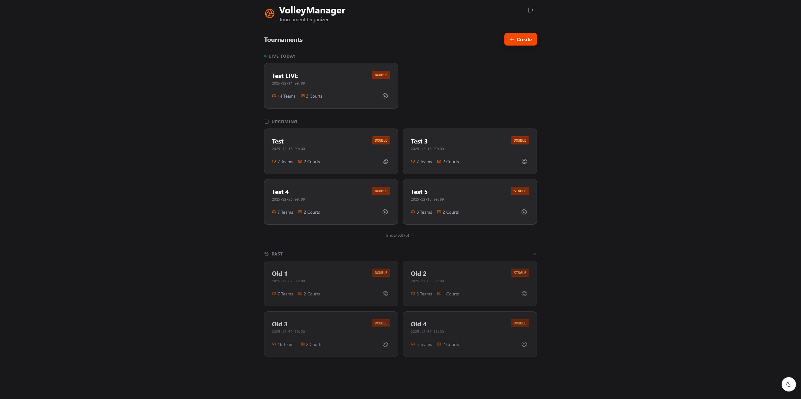

### Appearance Modes

Seamless support for both light and dark environments.

  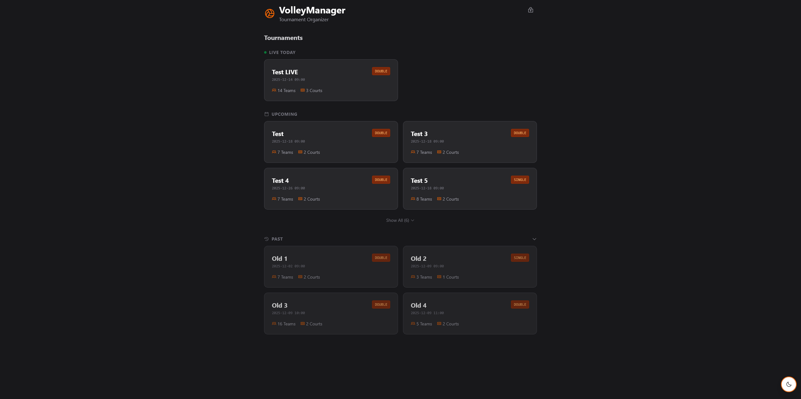
  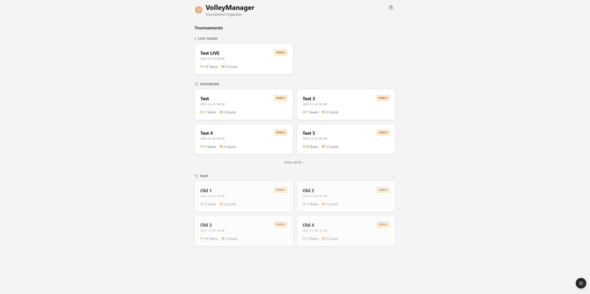

---

## Tournament Management

### Setup & Creation

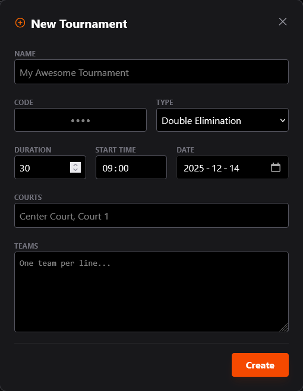

### Bracket Visualization

Dynamic bracket generation handling various tournament sizes.

  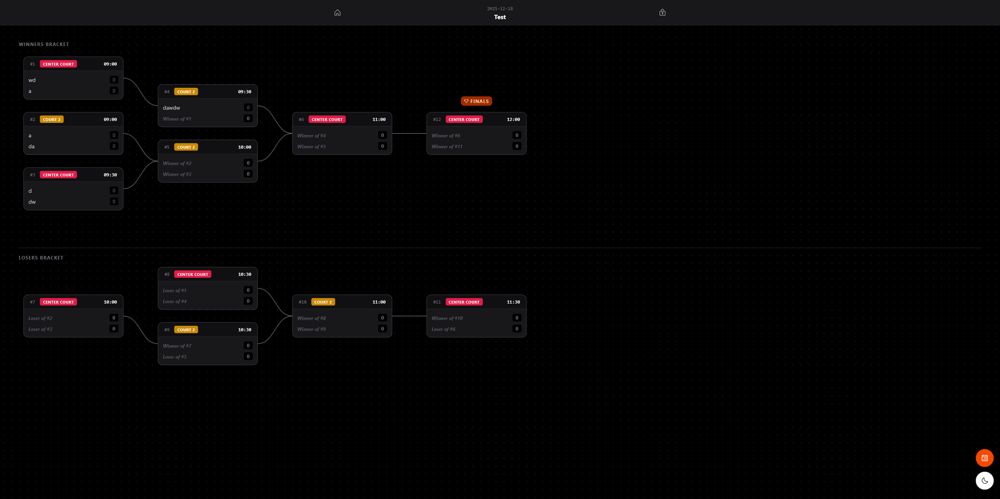
  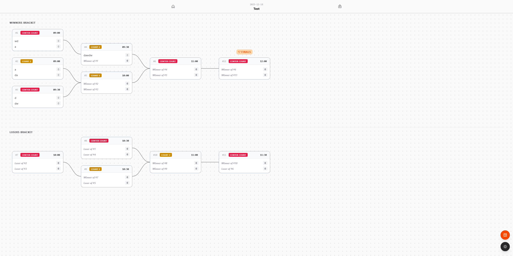

### Bracket Variants

**Single Elimination & Live Scoring**

  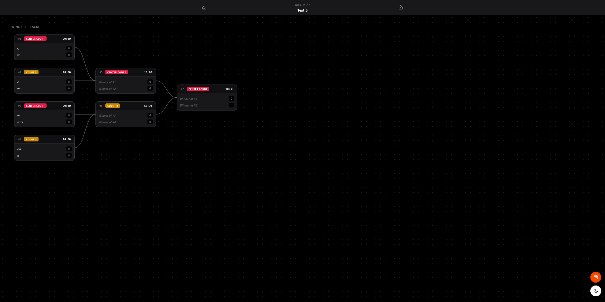
  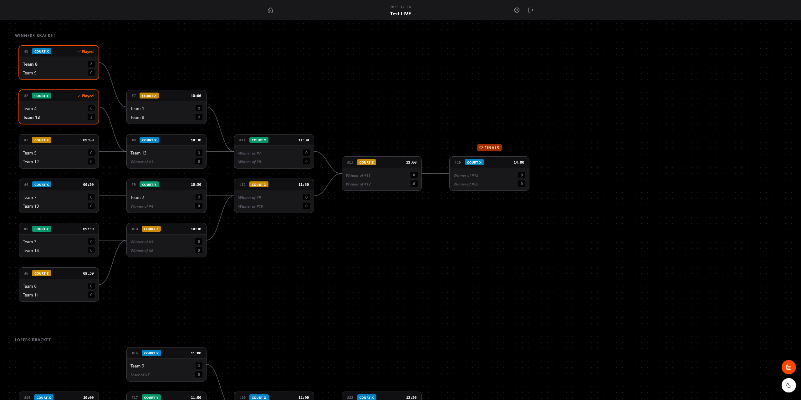

---

## Scheduling & Results

Automated scheduling views with real-time score updates.

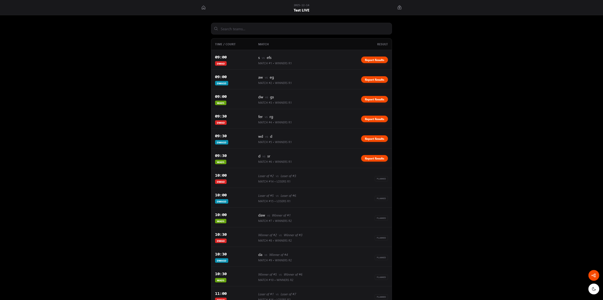

---

## Role-Based Scoring

Secure scoring interfaces for Referees and Administrators.

<table>
  <tr>
    <td width="50%" valign="top">
      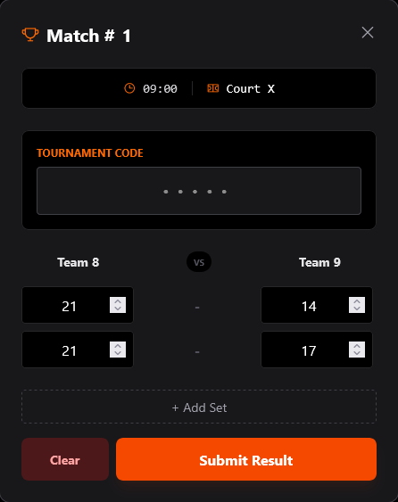
    </td>
    <td width="50%" valign="top">
      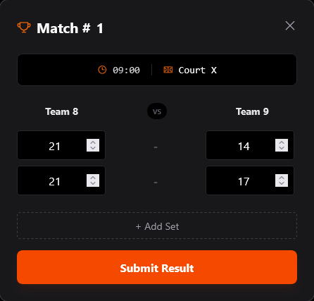
    </td>
  </tr>

  <tr>
    <td valign="top">
      <h3> Referee View</h3>
      

        <b>Restricted Access</b> 
        Referees must enter a tournament code to submit scores.
        <b>Note</b>: Clear only appears if scores are already submitted.
      

    </td>
    <td valign="top">
      <h3> Admin View</h3>
      

        <b>Full Access</b> 
        Admins are free to submit, edit, or override scores at any time without codes.
      

    </td>
  </tr>
</table>

## Deploy

Clone the repo and run the docker-compose or create your own. Create a .env file with your custom values there is an example.env available.
